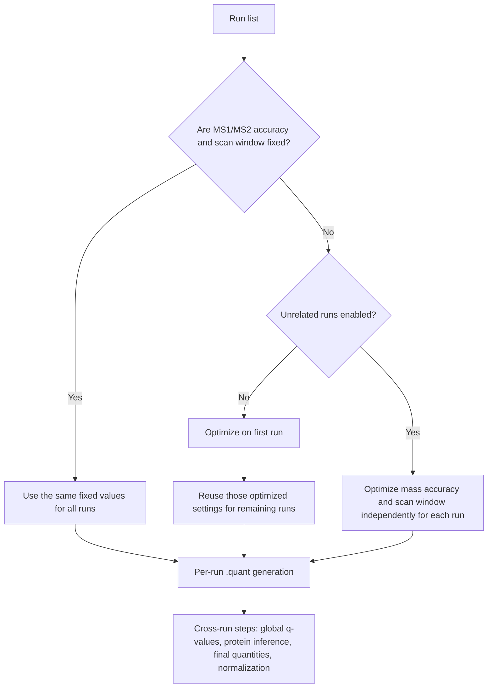

# Using DIA-NN Unrelated Runs Correctly

## Executive summary

In current DIA-NN documentation, **Unrelated runs** is a narrowly defined technical option: it tells DIA-NN to determine **automatic mass accuracies and scan window settings independently for different runs**. In the command-line reference, the underlying controls are `--individual-mass-acc` and `--individual-windows`. By default, if those parameters are left automatic, DIA-NN optimizes them on **the first run in the experiment** and then **reuses** the optimized settings for the remaining runs. The official guide explicitly warns that this default optimization is noisy and can make results depend on which file is first, and it therefore recommends fixing mass accuracies and scan window values for publication-ready analyses whenever possible. citeturn1view0turn13view1turn13view2turn28view2

The most important practical implication is that **Unrelated runs is not a “biology is unrelated” switch**. It does **not** tell DIA-NN to suppress cross-run FDR, protein inference, normalization, or quantification logic. Those later cross-run steps still happen after the per-run `.quant` stage. What Unrelated runs changes is the **per-run search/extraction tuning** when settings are automatic. Consequently, it is most useful when runs differ in their *technical* optimums, such as mixed gas-phase-fractionation and analytical DIA runs, materially different batches/acquisition schemes, or mixed cohorts whose peak widths or mass-accuracy optima differ enough that a single shared automatic setting is a poor compromise. citeturn1view0

For routine cohorts acquired on the **same LC-MS setup** with the **same acquisition method**, the best current DIA-NN practice is usually **not** “enable Unrelated runs forever,” but rather: run a few representative good files with Unrelated runs to learn suitable settings, compute a mean/consensus recommendation, then rerun production analyses with **fixed non-zero** `--mass-acc-ms1`, `--mass-acc`, and `--window` values. DIA-NN’s maintainer has explicitly recommended using representative good runs, excluding blanks/failed runs, and using the **mean** of recommended settings if you are converting exploratory estimates into fixed production parameters. citeturn1view0turn15view0turn23view0

In workflows involving **MBR** (`--reanalyse`), Unrelated runs affects the settings used during the MBR passes as well. DIA-NN documents a companion flag, `--mbr-fix-settings`, that forces the **same settings for all runs during the second MBR pass** when Unrelated runs is enabled. For mixed GPF + analytical DIA or otherwise heterogeneous first-pass data, the maintainer has recommended a **manual two-step MBR-like workflow** so that Unrelated runs can be used **during library creation only**, followed by a cleaner reanalysis of the real cohort with an empirical library and appropriate filtering. citeturn13view3turn6view0turn26view0

The bottom line is simple. Use Unrelated runs when the **technical heterogeneity of runs** makes per-run automatic tuning desirable. Do **not** enable it just because samples come from different biological conditions, patients, or time points. For heterogeneous technical collections, it is often helpful in **exploratory tuning** and sometimes in **empirical library generation**. For final production analysis, DIA-NN’s own guidance favors **fixed settings** over perpetual automatic tuning. citeturn1view0turn15view0

## Technical meaning of unrelated-runs

DIA-NN processes raw data in **two phases**. First, it performs the computationally intensive processing **separately for each run** and saves the identifications and quantitative information to `.quant` files. Second, once all runs are processed, it performs **cross-run** operations such as **global q-value calculation, protein inference, final quantity calculation, and normalization**. This architectural split is crucial for understanding Unrelated runs: it operates in the **per-run processing phase**, not in the later cross-run consolidation phase. citeturn1view0

The official guide states that mass accuracies and scan window are set to **0 by default**, which means DIA-NN will optimize them **automatically for the first run** and then reuse those optimized settings for the rest of the experiment. The guide further states that this optimization is **inherently noisy**, so even replicate injections may not yield identical estimates, and therefore the results can depend on file order. That is the background problem that Unrelated runs addresses. citeturn1view0turn0search4

In the current command-line reference, the documented flags are `--individual-mass-acc` and `--individual-windows`, both described as determining automatic settings **independently for different runs**. The GUI text for **Unrelated runs** describes exactly the same behavior. In other words, the documented technical meaning of the parameter is: **if mass accuracies and/or scan window are left automatic, estimate them per run rather than sharing the first run’s optimized values across the project**. citeturn1view0turn13view1turn13view2

That also means that if you have already supplied **fixed non-zero values** for `--mass-acc-ms1`, `--mass-acc`, and `--window`, Unrelated runs has little or no remaining job with respect to those parameters, because the independent-per-run logic only applies **“if set to automatic.”** This is one reason DIA-NN recommends fixing these values for reproducible production analysis. citeturn13view1turn13view2turn28view2

The current DIA-NN guide explicitly recommends one exploratory use case for Unrelated runs: run DIA-NN on **several representative runs** with Unrelated runs enabled and inspect the log entry **“Averaged recommended settings for this experiment.”** The same documentation and maintainer responses say that representative runs should be **good runs of interest**, excluding blanks/failed runs, and that using the **mean** of recommended settings is the preferred way to convert those exploratory values into fixed production settings. citeturn1view0turn15view0

The figure below summarizes the official logic.



This flowchart reflects the current DIA-NN manual and command-line reference. citeturn1view0turn13view1turn13view2turn27view0

One subtle but important conclusion follows from the official wording: **the parameter is about technical search-space tuning, not about whether runs are biologically related.** A time-course, case-control experiment, or perturbation study acquired on one stable method can still be “related” in the only sense that matters for this option: they may share the same optimal mass tolerance and scan-window settings. Conversely, heterogeneous acquisitions can be “unrelated” for this option even if they came from the same biological project. That is an inference from the documented behavior, but it is the inference most consistent with how DIA-NN defines the option. citeturn1view0

## Workflow consequences for libraries, MBR, FDR, and quantities

**Library generation.** DIA-NN’s core workflow typically starts with a predicted spectral library and then analyzes raw data, often generating an empirical DIA-based library on the way. If Unrelated runs is enabled, any automatically chosen mass accuracy and scan-window values used during raw-data analysis can differ **run by run**, which can change what DIA-NN identifies confidently enough to include in the empirical library and can therefore influence library refinement indirectly. The docs also recommend using separate predicted-library generation and data-analysis steps as the typical workflow, and a maintainer note states that before DIA-NN 1.9.1, certain combined-step workflows were not identical to doing the steps separately. citeturn29view2turn26view0

**MBR.** DIA-NN documents MBR (`--reanalyse`) as a two-pass procedure. In the first pass, it creates an empirical spectral library from the data; in the second pass, it reanalyzes the experiment with that empirical library. The docs emphasize that MBR is FDR-controlled using decoy precursors and proteins, and they recommend MBR for quantitative analyses based on predicted libraries, while recommending it be turned **off** when analyzing with an empirical library generated by DIA-NN. Because Unrelated runs affects automatic settings, it can influence the first pass, the second pass, or both; the companion flag `--mbr-fix-settings` exists specifically so that, when Unrelated runs is used with MBR, the **second pass** can still be forced to use the **same settings across all runs**. citeturn27view1turn27view0turn13view3

**Manual MBR-like workflows.** For heterogeneous collections such as mixed GPF and analytical DIA, the maintainer has explicitly recommended a manual workflow: analyze GPF and DIA together in library-free mode to create a spectral library, using Unrelated runs **during the library-creation stage only** so DIA-NN can use different optimal scan-window or mass-accuracy settings for different runs, and then reanalyze the real DIA experiment with the resulting library. In a separate official Q&A, the maintainer also describes manual two-step MBR imitation as a valid way to create a library from the whole experiment or a high-quality subset and then analyze the full set with MBR off. citeturn6view0turn26view0

**FDR control.** Unrelated runs does **not** define a new FDR model. DIA-NN’s FDR logic, including MBR’s decoy-based control, remains the same. What can change is the *input* to that FDR framework: different per-run tuning can alter which Elution groups/PSMs are found, which empirical library entries are created, and how strong the evidence is for each precursor. DIA-NN’s official FDR note also explains that any analysis borrowing information across runs, including MBR, complicates precursor-level entrapment validation because confidence in one run can be influenced by global confidence from the experiment. That caution applies to MBR itself more than to Unrelated runs, but it matters when assessing downstream effects. citeturn27view1turn17view0

**Filtering conventions.** DIA-NN’s official guidance is explicit here: if you do **not** use MBR, use **Global** q-values for global filtering; if you **do** use MBR, use **Lib** q-values for global filtering. The current README likewise defines `Lib.Q.Value` and `Lib.PG.Q.Value` as the library-global q-values relevant to empirical libraries and MBR first-pass libraries. So Unrelated runs can alter first-pass library content and thus indirectly alter `Lib.*` filtering outcomes, but it does not change the fundamental rule of which q-value family belongs to which workflow. citeturn6view0turn9view0

**Quantification.** Unrelated runs does **not** switch DIA-NN from Legacy quantification to QuantUMS or vice versa. DIA-NN’s current docs say QuantUMS is the default recommended mode in most cases, and they describe its own optimization and quality metrics independently of Unrelated runs. The parameter’s influence on quantification is therefore **indirect**: different per-run extraction settings can change precursor detection, fragment extraction quality, and the contents of `.quant` files, and those altered inputs then propagate into cross-run normalization and protein quantification. In mixed low-input and bulk analyses, DIA-NN’s QuantUMS paper specifically recommends training QuantUMS hyperparameters on the **low-amount subset** if the goal is best quantitative performance on those runs. citeturn8view0turn21view0turn1view0

The table below separates **direct** from **indirect** consequences.

| Processing component | Direct effect of Unrelated runs | Indirect downstream effect |
|---|---|---|
| Automatic MS1/MS2 accuracy choice | **Yes.** Per-run if automatic; otherwise shared-first-run or fixed values. citeturn13view1turn28view2 | Can alter calibration/search behavior and identification sensitivity. citeturn1view0 |
| Automatic scan window choice | **Yes.** Per-run if automatic. citeturn13view2turn28view2 | Can alter extraction/search timing and the precursor evidence entering `.quant`. citeturn1view0 |
| Empirical library generation | **No new library algorithm**, but different first-pass tuning can change what gets added to the library. citeturn27view1turn29view2 | Can change library size/content and thus later matching/IDs. citeturn6view0turn26view0 |
| Match-between-runs | **No.** MBR is still `--reanalyse`. citeturn27view0turn27view1 | Different first-pass tuning can change second-pass inputs; `--mbr-fix-settings` can stabilize pass two. citeturn13view3 |
| FDR model | **No.** Decoy-based FDR logic remains DIA-NN’s standard logic. citeturn27view1turn17view0 | q-values may shift because the evidence and/or empirical library changed. citeturn17view0turn9view0 |
| Quantification mode | **No.** Legacy vs QuantUMS is a separate choice. citeturn8view0 | Quantities can change because detected/quantified precursor evidence changed. citeturn1view0turn21view0 |

## Practical recommendations by scenario

The most reliable decision rule is: **drive this option from technical heterogeneity, not from biological labels.** If runs share one stable acquisition setup, leaving settings automatic-and-shared is acceptable for quick exploration, but DIA-NN’s own production recommendation is usually to **fix** the settings. If runs have materially different technical optima, Unrelated runs becomes useful, especially at the exploratory or library-building stage. citeturn1view0turn15view0

| Scenario | Recommendation for Unrelated runs | Rationale | Companion settings or workflow |
|---|---|---|---|
| Homogeneous label-free cohort on one LC-MS method and one instrument family | **Unset** for routine work; **prefer fixed values** | DIA-NN recommends fixed mass accuracies and scan window for publication-ready analyses, because shared automatic optimization is noisy. citeturn1view0turn28view2 | Use representative runs with Unrelated runs once, then set `--mass-acc-ms1`, `--mass-acc`, `--window`. citeturn1view0turn15view0 |
| Time-course or perturbation study acquired on the same method | **Unset** or **fixed**; biological time structure alone is *not* a reason to enable it | The documented behavior concerns automatic search settings, not biological comparability. A same-method time-course is usually technically “related” for this option even if biology changes strongly. citeturn1view0 | Consider normalization assumptions separately; Unrelated runs is not a normalization toggle. citeturn1view0 |
| Multiple batches on the same platform with stable chromatography and similar recommended settings | **Conditional**, but usually still **fix values** | If recommended settings are similar across good representative runs, a single fixed setting is cleaner and more reproducible. citeturn15view0turn23view0 | Estimate from representative runs, then use batch-invariant fixed settings if feasible. citeturn15view0 |
| Multiple batches with noticeably different peak widths or automatic recommended accuracies | **Conditional to Use**, especially during exploratory tuning | This is exactly the kind of technical heterogeneity for which per-run automatic estimation can be helpful. DIA-NN also says the mean of recommended settings is the preferred fixed summary if you later collapse back to one setting. citeturn1view0turn15view0 | Either split batches, or derive batch-specific/final fixed values. Inspect QC plots and logs. citeturn12search0turn15view0 |
| Mixed GPF + analytical DIA used to create an empirical library | **Use during library creation** | Maintainer guidance explicitly recommends this as an advantage of manual library creation over one-shot MBR, because different run types can need different scan-window/mass-accuracy settings. citeturn6view0 | Then reanalyze the real analytical cohort with the resulting empirical library, usually with MBR off if the library is already DIA-NN empirical. citeturn27view1turn26view0 |
| Predicted-library quantitative analysis of a standard cohort with MBR | **Usually Unset** after fixing values; **Conditional** if still exploratory | MBR itself is recommended for predicted-library quantitative analyses, but fixed settings are the preferred production state. citeturn27view1turn28view2 | If you combine Unrelated runs with MBR, consider `--mbr-fix-settings`. citeturn13view3 |
| Final analysis with a DIA-NN empirical library generated from matching sample types | **Unset** | DIA-NN recommends MBR off when using an empirical library generated by DIA-NN; at that point stable fixed settings are usually preferable. citeturn27view1 | Use fixed settings and optionally Reuse `.quant` for fast reanalysis. citeturn1view0turn27view0 |
| Mixed instruments or acquisition modes in one project | **Conditional to Use** for exploratory/library-building; often **separate analyses are safer** | DIA-NN documents different starting mass-accuracy values by platform and explicitly warns not to use non-timsTOF empirical libraries to analyze timsTOF data. That implies that technical compatibility matters more than biological grouping. citeturn28view2 | Prefer separate empirical libraries/analyses when platform mismatch is substantial, especially if timsTOF is involved. citeturn28view2 |
| Low-input runs coanalyzed with higher-input related runs or matching enhancers | **Conditional**, but not because of “relatedness” in the name | DIA-ME data analyzed with DIA-NN showed low false discovery/false transfer rates when low-input runs were coanalyzed with matching enhancers, but the more important quantitative control here is MBR-like matching and QuantUMS training on the relevant subset. citeturn20view0turn21view0 | Consider MBR/DIA-ME logic and train QuantUMS on the low-input subset if that is the target use case. citeturn21view0turn20view0 |
| Multiplexed plexDIA / SILAC / dimethyl experiment on one stable acquisition method | **Same rule as label-free** | DIA-NN’s multiplexing docs introduce channel-specific confidence and normalization, but Unrelated runs still only concerns automatic mass accuracy/scan-window estimation. Labeling itself does not imply enabling it. citeturn24view0turn24view1turn1view0 | For turnover SILAC or throughput multiplexing, choose the appropriate channel normalization mode separately. citeturn24view1 |
| Unrelated sample types pooled into one analysis only to maximize completeness | **Usually avoid** or **use only for exploratory library building** | DIA-NN recommends empirical libraries for experiments with **matching sample types**. Pooling very different sample types may still “work,” but it increases the risk that a shared library/MBR strategy is no longer biologically or technically well matched. This is a best-practice inference from the official matching-sample-type guidance. citeturn27view1turn18search7 | Prefer separate libraries or compare with and without MBR; inspect first-pass versus final outputs. citeturn27view1turn6view0 |

A useful side note for your “related-runs” question: in the **current official command-line reference**, the relevant documented controls are `--individual-mass-acc`, `--individual-windows`, `--reanalyse`, and `--mbr-fix-settings`. I did **not** find a separately documented `--related-runs` flag in the current official DIA-NN README/manual. The closest “related runs” behavior in today’s docs is simply **leaving Unrelated runs off** or, better, **fixing the search settings explicitly**. citeturn13view1turn13view2turn27view0turn13view3

A short decision checklist is therefore:

- If your runs share one acquisition scheme and one platform, **prefer fixed settings** over any automatic mode. citeturn1view0turn28view2  
- If you are still discovering suitable settings, run a **small representative good subset** with Unrelated runs, then convert to fixed values. citeturn1view0turn15view0  
- If you are mixing **technically different** runs only to build an empirical library, Unrelated runs is often reasonable **only in that stage**. citeturn6view0turn26view0  
- If you are using **MBR + Unrelated runs**, decide whether the second pass should be stabilized with `--mbr-fix-settings`. citeturn13view3  
- If you are tempted to enable it only because conditions are biologically different, that is usually the **wrong reason**. citeturn1view0

## Risks, alternatives, and quality control

The first downside of Unrelated runs is conceptual: it can encourage users to stay in an **automatic-setting regime** longer than DIA-NN’s own guide recommends. The official manual is very clear that, for publication-ready or production-ready analyses, it is preferable to **adjust and fix** mass accuracies and scan window values rather than keep relying on automatic optimization. The maintainer also notes that DIA-NN is not very sensitive to these parameters as long as they are not extreme, which further reduces the case for leaving them auto-tuned forever once sensible values are known. citeturn1view0turn15view0turn23view0

The second downside is reproducibility and incremental processing. DIA-NN strongly recommends reusing `.quant` files only when mass accuracies and scan window are **fixed to specific non-zero values**; otherwise DIA-NN may reoptimize using the first run lacking a `.quant` and thereby reintroduce shifting settings into a supposedly incremental workflow. For large or longitudinal projects, the official incremental-processing guidance again points toward **empirical libraries + fixed settings + Reuse `.quant`**, not toward indefinite dependence on per-run auto optimization. citeturn1view0turn27view0

The third downside is that Unrelated runs can be mistaken for a protection against poor experimental design choices. It does **not** by itself solve problems caused by mismatched sample types, overbroad shared empirical libraries, poor normalization assumptions, or inappropriate MBR across technically incompatible datasets. DIA-NN’s official guidance on MBR emphasizes matching sample types, comparing first-pass and second-pass outputs when necessary, and turning MBR off when analyzing with a DIA-NN empirical library. citeturn27view1turn18search7

The main official **alternatives and complements** are straightforward. First, fix `--mass-acc-ms1`, `--mass-acc`, and `--window` after exploratory tuning. Second, if you use MBR together with Unrelated runs, add `--mbr-fix-settings` if you want the second pass stabilized. Third, for mixed or large experiments, use a **manual two-step empirical-library workflow** based on a representative or high-quality subset. Fourth, if quantification is the challenge rather than identification, use QuantUMS controls such as `--quant-train-runs` or `--quant-params`, especially in mixed low-input and bulk analyses. citeturn28view2turn13view3turn26view0turn8view0turn21view0

Quality control should focus on whether the setting is revealing genuine technical heterogeneity or merely masking unstable automation. Since DIA-NN 2.0, release notes state that the PDF report includes **per-run QC plots** including distributions of PSMs over RT and IM, plus information on **peak widths** and **MS1 mass accuracy**. Those are the first diagnostics to inspect when deciding whether a shared fixed setting is adequate or whether a subset/library-building stage really benefits from Unrelated runs. citeturn12search0

A practical QC heuristic is this: if representative same-method replicates show **widely divergent recommended settings**, or if enabling Unrelated runs changes results much more than expected, the right response is usually **not** “leave Unrelated runs on,” but rather to inspect run quality, exclude blanks/failed runs from tuning, and decide whether fixed settings should be estimated from a cleaner representative subset or whether the dataset should be split into separate technical cohorts. That conclusion is a best-practice synthesis from DIA-NN’s guidance to use representative good runs, exclude blanks/failed runs, and use mean settings. citeturn15view0turn1view0

The table below lists concrete signs of misuse.

| QC symptom | Likely interpretation | What to do |
|---|---|---|
| File order changes IDs or optimized mass accuracy in the default automatic workflow | Shared-first-run optimization is affecting the whole cohort. citeturn1view0turn0search4 | Either use Unrelated runs for exploratory tuning or, better, fix settings explicitly and rerun. citeturn1view0 |
| Wide spread in per-run peak width or recommended MS1/MS2 accuracy on a supposedly homogeneous cohort | The cohort may not be technically homogeneous, or some runs are low quality. citeturn12search0turn15view0 | Exclude blanks/failed runs from tuning; consider splitting batches or deriving fixed values from the mean of good runs. citeturn15view0 |
| MBR final output looks worse than first-pass output with a project-specific DDA library | The empirical second-pass library may not be helping. citeturn27view1turn6view0 | Compare first-pass and final reports; if first pass wins, turn MBR off and reuse `.quant`. citeturn27view1 |
| Final analysis uses a DIA-NN empirical library but still keeps MBR on | This contradicts official guidance. citeturn27view1 | Turn MBR off for the final empirical-library analysis. citeturn27view1 |
| Mixed low-input and bulk runs show poor low-input quantification despite good IDs | The problem may be quantification training rather than search tuning. citeturn21view0 | Train QuantUMS on the low-input subset; do not expect Unrelated runs alone to fix it. citeturn21view0 |
| In MBR analyses, filtering uses `Global.*` rather than `Lib.*` q-values | Filtering convention is inconsistent with the workflow. citeturn6view0turn9view0 | Use `Lib.Q.Value` and `Lib.PG.Q.Value` for MBR-driven global filtering. citeturn6view0turn9view0 |

If you need extra confidence in specific identifications after any of these workflows, DIA-NN also documents optional **PEP-based** filtering in addition to q-values. That is not specific to Unrelated runs, but it is a sensible downstream safeguard when you suspect marginal evidence. citeturn9view3

## Command-line examples and minimal reproducible designs

The examples below use only currently documented CLI options. They are intended to illustrate the **effect of Unrelated runs on tuning behavior**, not to prescribe the full optimal pipeline for every use case. Where the examples refer to a predicted library, you can generate that in a separate DIA-NN library-preparation step as recommended by the official workflow docs. The same docs also point to a small public benchmark package in the Slice-PASEF benchmarks repository for quick trial analyses, and they describe the DIA-NN Wizard as a set of interactive tutorials. citeturn29view2

**Example A: exploratory tuning on representative good runs.**  
Use this when you want DIA-NN to estimate per-run optimal settings before deciding on fixed production parameters.

```bash
diann.exe \
  --f rep1.raw --f rep2.raw --f rep3.raw --f rep4.raw \
  --lib project.predicted.speclib \
  --fasta project.fasta \
  --individual-mass-acc \
  --individual-windows \
  --qvalue 0.01 \
  --out tune.parquet
```

What to inspect afterward is the log: look for each run’s recommended or optimized mass-accuracy/peak-width information and the final **“Averaged recommended settings for this experiment”** summary. The official docs recommend this exact strategy on several representative runs, and maintainer guidance says the representative set should consist of good runs of interest rather than blanks or failed runs. citeturn1view0turn15view0

**Example B: production rerun with fixed values.**  
Once you have chosen stable settings, convert to fixed production parameters.

```bash
diann.exe \
  --f run1.raw --f run2.raw --f run3.raw --f run4.raw \
  --lib project.predicted.speclib \
  --fasta project.fasta \
  --mass-acc-ms1 7 \
  --mass-acc 10 \
  --window 6 \
  --qvalue 0.01 \
  --out final.parquet
```

This is the workflow DIA-NN’s own guide points toward for publication-ready analysis. The docs also provide platform-specific starting points, such as 15/15 ppm for timsTOF and 4/10 ppm for Orbitrap Astral, with scan window set to the approximate number of MS/MS data points per peak. citeturn28view2

**Example C: mixed GPF and analytical DIA library refinement without one-shot MBR.**  
This is the official-type scenario where Unrelated runs is especially helpful.

```bash
diann.exe \
  --f gpf1.raw --f gpf2.raw --f dia1.raw --f dia2.raw \
  --lib project.predicted.speclib \
  --fasta project.fasta \
  --gen-spec-lib \
  --individual-mass-acc \
  --individual-windows \
  --qvalue 0.01 \
  --out mixed_build.parquet \
  --out-lib mixed_empirical.parquet
```

This uses one heterogeneous set to refine an empirical library but does **not** enable MBR, so the role of Unrelated runs is confined to the tuning of that library-building analysis. That setup is directly aligned with the maintainer’s advice for mixed GPF + DIA, where the main advantage is letting different run types use different optimal settings while building the empirical library. citeturn6view0turn26view0

**Example D: final reanalysis of the analytical DIA cohort with the empirical library.**  
Once the empirical library exists, analyze the real cohort cleanly.

```bash
diann.exe \
  --f dia1.raw --f dia2.raw --f dia3.raw --f dia4.raw \
  --lib mixed_empirical.parquet \
  --fasta project.fasta \
  --mass-acc-ms1 7 \
  --mass-acc 10 \
  --window 6 \
  --qvalue 0.01 \
  --out analytical_final.parquet
```

DIA-NN’s documentation says MBR should be **turned off** when analyzing with an empirical library generated by DIA-NN. In this final step, the empirical library already embodies the first-pass learning, so a stable fixed-setting analysis is usually the cleaner choice. citeturn27view1

**Example E: MBR with Unrelated runs, but fixed second-pass settings.**  
Use this only if you specifically want a one-shot MBR analysis yet do not want the second pass drifting run-by-run.

```bash
diann.exe \
  --f run1.raw --f run2.raw --f run3.raw --f run4.raw \
  --lib project.predicted.speclib \
  --fasta project.fasta \
  --reanalyse \
  --individual-mass-acc \
  --individual-windows \
  --mbr-fix-settings \
  --qvalue 0.01 \
  --out mbr_fixed_second_pass.parquet
```

The official function of `--mbr-fix-settings` is exactly this: when Unrelated runs is combined with MBR, the flag forces the **same settings in the second MBR pass**. If you want the flexibility of per-run first-pass optimization but a stabilized second pass, this is the documented companion parameter. citeturn13view3turn27view0

A very useful **minimal reproducible design** for understanding the effect of Unrelated runs is a **run-order test**:

```bash
# Order 1, default automatic behavior
diann.exe \
  --f A.raw --f B.raw --f C.raw --f D.raw \
  --lib project.predicted.speclib \
  --fasta project.fasta \
  --qvalue 0.01 \
  --out order1.parquet

# Order 2, same files but different first file
diann.exe \
  --f D.raw --f A.raw --f B.raw --f C.raw \
  --lib project.predicted.speclib \
  --fasta project.fasta \
  --qvalue 0.01 \
  --out order2.parquet
```

Then rerun the same two commands with `--individual-mass-acc --individual-windows`, and finally rerun with fixed `--mass-acc-ms1 --mass-acc --window`. According to the official docs and user-reported file-order issue, the default automatic mode can produce order-dependent results because the first run seeds shared automatic settings. The Unrelated-runs version should remove that **shared-first-run** dependency, while the fixed-setting version is the cleanest reproducible reference. citeturn1view0turn0search4turn28view2

In interpreting those tests, the primary readouts are:

- the log text about whether DIA-NN optimized settings only for the first run or independently per run; citeturn1view0turn13view1turn13view2  
- the per-run recommended/optimized mass accuracies and peak widths; citeturn25search2turn25search4turn12search0  
- identification counts and completeness in first-pass versus final MBR reports when MBR is involved; citeturn27view1turn6view0  
- whether filtering is done with the correct q-value family for the workflow (`Global.*` without MBR, `Lib.*` with MBR). citeturn6view0turn9view0

Finally, a brief version note. I found the **same core meaning** of Unrelated runs in 2021 maintainer discussions and in the current 2026 README/manual: independent automatic determination of mass accuracies and scan window on a per-run basis. What **has** changed around it is the broader DIA-NN engine and best-practice context: DIA-NN 1.9.2 introduced a redesigned mass-calibration algorithm, DIA-NN 2.0 introduced major search/calibration architecture changes and richer per-run QC reporting, and maintainer guidance notes that some combined-step library-generation behavior before 1.9.1 was not identical to separate-step workflows. So the semantics of the flag appear stable, but the surrounding performance and recommended workflow have evolved. citeturn6view0turn12search0turn26view0